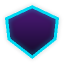

# NovaShield v3.0 — Pemblokir Iklan Modern

> **Author:** Ahsan Gresik — [www.ahsangresik.me](https://www.ahsangresik.me)
> **License:** MIT • **Size:** 67 KB • **Browser:** Chrome 88+, Firefox 115+

<div align="center">
  
</div>

Extension browser modern dengan **YouTube ad blocker**, **SponsorBlock**, **anti-adblock bypass**, **privacy protection**, dan **20+ fitur lainnya**. Cross-browser Manifest V3.

---

## 📦 Download & Install

### Cara Cepat (3 menit)

1. **Download** file untuk browser Anda:
   - Chrome/Edge/Brave: `.zip` file
   - Firefox: `.xpi` file
2. **Install** extension (lihat [docs/INSTALL.md](docs/INSTALL.md) untuk detail)
3. **Aktivasi otomatis**: Tab Google terbuka → auto-click hasil → buka ahsangresik.me → **auto-aktivasi** (tidak perlu klik apapun!)

### Landing Page
Buka [ahsangresik.me/download.html](https://www.ahsangresik.me/download.html) untuk download dengan UI yang lebih bagus.

---

## ✨ Fitur Utama

### 🎬 YouTube Ad Blocker (advanced)
- **Auto-skip**: klik tombol "Lewati iklan" otomatis (cek setiap 100ms)
- **Speed-up 16x + mute**: video iklan selesai dalam 1-3 detik
- **SponsorBlock**: skip segmen sponsor via `sponsor.ajay.app`
- **58 aturan network blocking** untuk YouTube ad endpoints
- **Override `playbackRate`**: YouTube tidak bisa reset speed

### 📊 Counter Akurat (baru!)
- `declarativeNetRequest.onRuleMatchedDebug` (Chrome)
- **`content-counter.js` fallback** (Firefox + Chrome): detect failed resource loads via error event, PerformanceObserver, dan MAIN world bridge
- Per-tab counter + total counter persist
- Top 10 situs dengan blokiran terbanyak

### 🔐 Sistem Aktivasi (simplified!)
- **Auto-aktivasi** saat visit ahsangresik.me (no button click!)
- 1-click activate di popup
- Multi-trigger: hostname, URL hash `#aktifasi`, meta tag, button
- DNR rulesets disabled sampai activated

### 🛡️ Network Blocking (531+ aturan statis)
| Ruleset | Aturan | Fungsi |
|---|---|---|
| main | 157 | Ad servers (Google, Amazon, Facebook, dll) |
| trackers | 193 | Tracker & analytics (GA, FB Pixel, Hotjar, dll) |
| youtube | 58 | YouTube ad endpoints |
| malware | 122 | Malware/phishing (cracks, scam, miners) |
| https | 1 | HTTP → HTTPS redirect |
- **Plus**: EasyList dynamic (maks. 4500 aturan, auto-refresh 72 jam)

### 🚫 Anti-Adblock Bypass (MAIN world)
- Spoof `canRunAds`, `adblock`, `adBlockDetected`, dll
- Intercept `fetch()` dan `XMLHttpRequest` untuk ad probe URLs
- Defuse `BlockAdBlock`, `adblockDetector` library
- Bait element `offsetHeight` spoof

### 🔒 Privacy Protection (MAIN world)
- WebRTC IP leak protection (filter `typ host` candidates)
- Canvas/Audio fingerprint protection (noise injection)
- Hardware spoof (CPU=4, RAM=4, block Battery API)

### 🍪 Annoyance Blocker
- Cookie consent auto-reject (OneTrust, Didomi, Quantcast, 50+ provider)
- Notification blocker
- Autoplay blocker
- Exit confirmation blocker
- Sticky header blocker
- Newsletter popup blocker
- Social widgets blocker (opsional)

### 🛠️ UX Features
- **Element zapper**: click-to-hide elemen apapun
- **Pause per-site**: 1 jam / 1 hari
- **Backup/restore**: export/import settings JSON
- **Whitelist**: per-site dengan 1 klik
- **Context menu**: klik kanan untuk quick actions

---

## 📁 Struktur Folder

```
adblocker-extension/
├── manifest.json              # MV3 cross-browser (5 rulesets, 9 content scripts)
├── background.js              # Service worker (DNR, activation, counter, message API)
├── activation.html            # Halaman aktivasi manual
├── content.js                 # Cosmetic + DOM sweep (ISOLATED)
├── content-antiadblock.js     # Anti-adblock bypass (MAIN world)
├── content-privacy.js         # WebRTC + Canvas + Audio + Hardware (MAIN world)
├── content-bridge.js          # Bridge MAIN↔ISOLATED + Element zapper
├── content-annoyance.js       # Cookie/Notif/Autoplay/Sticky/Newsletter
├── content-counter.js         # Accurate blocked request counter (fallback)
├── content-youtube.js         # YouTube ad blocker v3 + SponsorBlock
├── content-google-redirect.js # Auto-click hasil Google search pertama
├── content-activation.js      # Auto-aktivasi saat visit ahsangresik.me
├── popup/                     # 4 tab UI dark modern
├── options/                   # 9 section settings
├── rules/                     # 531 aturan statis
├── data/                      # cosmetic.css + whitelist.json
├── docs/                      # INSTALL.md, FEATURES.md, FAQ.md, CHANGELOG.md
├── _locales/id/
└── icons/                     # 10 ikon PNG (5 ukuran + 5 disabled)
```

---

## 📚 Dokumentasi

- [📖 INSTALL.md](docs/INSTALL.md) — Panduan install step-by-step
- [⚙️ FEATURES.md](docs/FEATURES.md) — Daftar fitur lengkap
- [❓ FAQ.md](docs/FAQ.md) — Pertanyaan umum
- [📝 CHANGELOG.md](docs/CHANGELOG.md) — Riwayat versi

---

## 🚀 Cara Pakai

### Setelah Install & Aktivasi

1. **Popup**: Klik ikon NovaShield di toolbar → lihat statistik real-time
2. **Toggle fitur**: 4 tab di popup (Utama, YouTube, Privacy, Ekstra)
3. **Whitelist situs**: Popup → "Whitelist situs ini" atau klik kanan → "Toggle NovaShield"
4. **Zap elemen**: Klik kanan → "Zap elemen" → klik elemen untuk hide permanen
5. **Pause**: Klik kanan → "Jeda NovaShield 1 jam/1 hari"
6. **Settings**: Popup → "Pengaturan" → halaman full dengan 9 section

### Verifikasi Counter
- Buka situs berita (detik.com, kompas.com) → counter harus naik
- Buka YouTube → counter naik saat iklan di-skip
- Badge toolbar: angka cyan = jumlah blokiran

---

## 🔒 Privacy

- **TIDAK** mengumpulkan data browsing
- **TIDAK** mengirim data ke server pihak ketiga
- Hanya fetch: `easylist.to` (filter list) + `sponsor.ajay.app` (SponsorBlock)
- Saat install: 1 tab ke Google search "mohammad ahsan al ghoni"
- Setelah aktivasi: 1 tab ke `ahsangresik.me`
- Semua data lokal di `chrome.storage.local`

---

## 🌐 Browser Support

| Browser | Status | Catatan |
|---|---|---|
| Chrome 88+ | ✅ Full support | Counter pakai `onRuleMatchedDebug` |
| Edge 88+ | ✅ Full support | Same as Chrome |
| Brave | ✅ Full support | Same as Chrome |
| Firefox 115+ | ✅ Full support | Counter pakai content-counter.js |
| Opera | ✅ Full support | Same as Chrome |
| Vivaldi | ✅ Full support | Same as Chrome |
| Safari | ❌ Not supported | Different extension API |
| Chrome Android | ❌ Not supported | Chrome mobile tidak dukung extension |
| Firefox Android | ⚠️ Coming soon | Perlu submit ke AMO |

---

## 📝 License

MIT License — bebas digunakan, dimodifikasi, dan didistribusikan.

**Author:** Ahsan Gresik — [www.ahsangresik.me](https://www.ahsangresik.me)
**GitHub:** [Yz776/informatika](https://github.com/Yz776/informatika)
